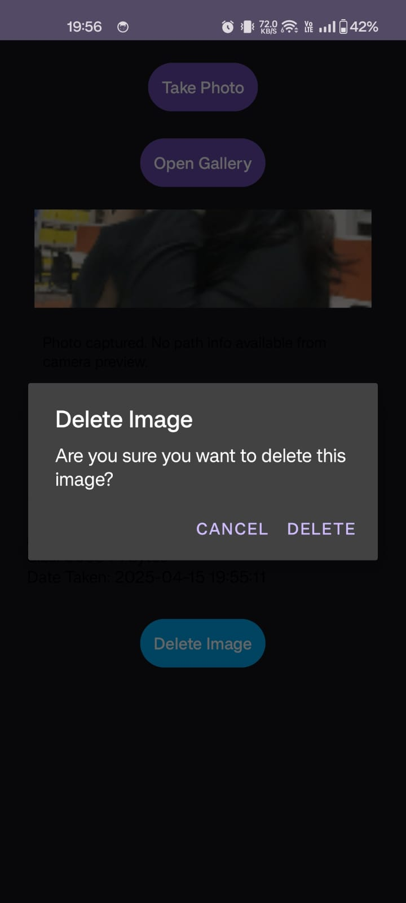

📸 Camera and Gallery App
🔍 Overview
This is a simple Android application developed in Java using Android Studio that allows users to:

Capture photos using the device camera.

Save photos to a chosen folder.

View all images in a selected folder in a gallery grid format.

View image details and delete selected images.
OUTPUT:

